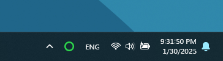

# Loop

### Online status in your menu bar
 

> [!NOTE]
> ## How does it work?
> Every 20 seconds, it sends a GET request to “google.com”. 
> If that fails, it sends a GET request to "github.com”.  
> If both requests fail, it considers the internet to be offline.
 

> [!NOTE]
> ## How is it different from just checking whether the Wi-Fi is connected?
> A Wi-Fi connection only means you are connected to a network. 
> The app verifies internet access by connecting to “google.com”, 
> ensuring you’re truly online.
 

> [!IMPORTANT]
> ## Tested on
> - Windows 11
 

